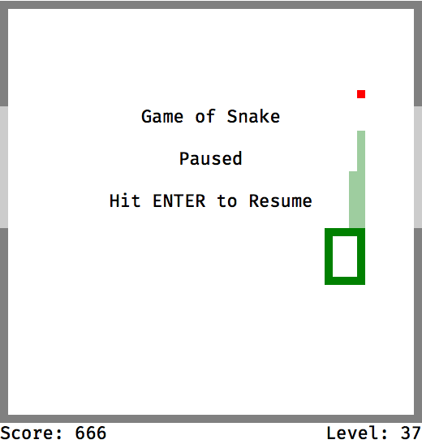

# Game of Snake
A classic snake game written as a test assignment to join Neotech Development frontend team.

## [Play](https://tymo.name/projects/snake-2017)

## Prerequisites
* Installed `node.js`
* Either `npm` or `yarn` package manager

## Install
* `git clone git@github.com:sergetymo/snake-2017.git && cd snake-2017`
* `npm install` or `yarn`

## Usage
* `npm run build` or `yarn build`

This puts standalone, transpiled and ready-to-use version into `dist/` folder.

## Tech used
* Vanilla JavaScript using ES6 and ES7 features.
* Webpack and Babel to transpile code into browser-executable JavaScript.
* Native DOM API to manipulate nodes.
* Pluggable renderer interface to implement, for example, console-based output.

## Easter egg
You also can use `vim` movement keys (`hjkl`) to control snake.
